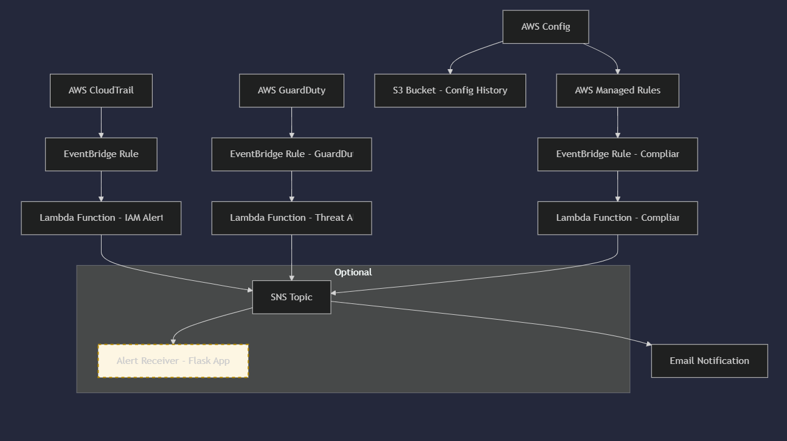

# AWS Security Alerting Pipeline


End-to-end **AWS security monitoring and alerting pipeline** built with Terraform and Python.

The project detects suspicious cloud activity (GuardDuty findings, IAM events, configuration drift) and sends real-time alerts to Slack.

---

# Architecture



## Alert Flow

```text
GuardDuty / AWS Config / EventBridge
        │
        ▼
       SNS
        │
        ▼
     Lambda
        │
        ▼
      Slack
```

---

# Use Case

The pipeline detects and alerts on events such as:

- IAM user creation
- Root login without MFA
- GuardDuty findings (SSH brute-force, port scanning)
- Non-compliant AWS Config resources (e.g. public S3 bucket)

Example trigger:

> Detect when a new IAM user is created (`CreateUser` event in AWS CloudTrail)

---

# Tech Stack

| Layer | Technology |
|------|-------------|
| Infrastructure as Code | Terraform |
| Detection | CloudTrail, GuardDuty, AWS Config |
| Processing | AWS Lambda (Python) |
| Messaging | SNS |
| Alerting | Slack |
| Optional UI | Flask (Docker / Kubernetes) |

---
## Local Development

Install dependencies:

```bash
pip install -r requirements-dev.txt
```

Run tests:

```bash
pytest -q --maxfail=1 --disable-warnings --cov=lambda_src
```

Run linter:

```bash
flake8 lambda_src tests
```

Format code:

```bash
black .
```

This allows reproducing the same checks locally that run in CI.
---

# Project Structure

```text
terraform/              Infrastructure as Code
lambda/                 Lambda functions (Python)
tests/                  Test events and unit tests
alert-receiver/         Flask alert receiver (Docker)
ansible/                Provisioning scripts
k8s/                    Kubernetes manifests
docs/                   Documentation and screenshots
frontend/               Optional UI dashboard
```

---

# Author

**Adam Wrona**  
Aspiring DevOps / AWS Cloud Engineer

GitHub: https://github.com/cloudcr0w  
LinkedIn: https://www.linkedin.com/in/adam-wrona-111ba728b

---

# License

MIT