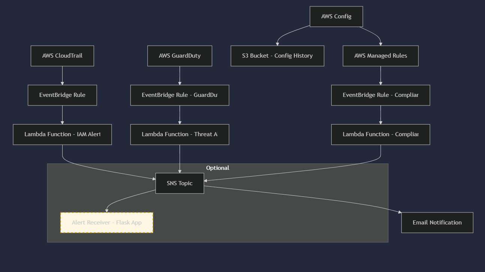

# 🛡️ AWS Security Alerting Pipeline


### AWS-native alerting system for IAM and GuardDuty events – built with Terraform, Lambda and SNS

This project demonstrates a simple and effective AWS security alerting pipeline that detects IAM and GuardDuty security events and sends notifications via email using AWS services.

---

## 🚨 Use Case: Real-Time AWS Security Monitoring

The pipeline captures specific security-related events, such as:

- IAM user creation (`CreateUser`)
- GuardDuty findings (e.g., SSH brute-force)

Once detected, the pipeline sends an email alert to notify administrators of potential risks or unauthorized changes in the AWS environment.

---

## 🔐 Automated Threat Detection & Response

This project implements an automated security alerting pipeline using AWS native services. It is designed to detect threats and configuration drift in real-time, and respond with notifications or actions.

### 🔎 Active Detection Sources:
- **AWS CloudTrail**: Tracks IAM actions like `CreateUser`, `AttachRolePolicy`
- **AWS GuardDuty**: Detects suspicious activities such as SSH brute-force attempts, reconnaissance, and port scans
- **AWS Config**: Continuously monitors misconfigured resources (e.g., public S3 buckets)

### ⚙️ Response Mechanism:
- **EventBridge** rules trigger **Lambda** functions for event parsing
- **SNS** notifies administrators (email/SMS/webhook)
- **Optional**: alerts can be consumed by the built-in `Flask` app or integrated with Slack/Discord

This pipeline is extendable, serverless, and built entirely with Terraform.

---


## ✅ Initial Use Case

> Detect and alert when a new IAM user is created (CreateUser event in AWS CloudTrail).

---

## 🧱 Architecture



---

## 🔧 Services Used

- **AWS CloudTrail** – Logs account activity  
- **Amazon EventBridge** – Filters specific events  
- **AWS Lambda (Python)** – Processes and formats alert messages  
- **Amazon SNS** – Sends email notifications  
- **AWS GuardDuty** – Detects security threats

---

## 📁 Project Structure

- `terraform/` – Infrastructure as code  
- `lambda/` – Lambda function code (Python)  
- `samples/` – Sample input events and variables  
- `alert-receiver/` – Flask container to simulate external alert handling  
- `k8s/` – Simple Kubernetes deployment config  
- `README.md` – Project documentation

---

## ⚙️ How It Works

1. CloudTrail records all actions in the account  
2. EventBridge rule filters for specific actions (e.g., CreateUser)  
3. The rule triggers a Lambda function  
4. Lambda formats the alert and publishes to an SNS topic  
5. SNS sends an email notification

---

## 🛡️ GuardDuty Integration (in progress)

This project will support GuardDuty-based detection for:

- Brute-force SSH attacks  
- Malicious IP traffic  
- Unauthorized EC2 access

Current progress:

- ✅ GuardDuty detector created  
- 🔄 EventBridge rule + Lambda forwarding in development

---


## 🛡️ AWS Config - Security status monitoring

The project uses [AWS Config](https://docs.aws.amazon.com/config/latest/developerguide/WhatIsConfig.html) to continuously monitor the configuration of resources in the cloud. The service is configured to:

- Logging all resources supported by AWS Config
- Collecting data from the region and global resources (e.g. IAM)
- Save configurations to a dedicated S3 bucket
- Running security rules (managed rules)

### 🔐 Current rules

| Name of rule | Description | | Rule name
|----------------------------------|--------------------------------------------------------|
| `iam-password-policy` | Checks whether the password policy meets the minimum requirements |.

## 💬 Slack Alerts (NEW)

This project now includes integration with **Slack** to send real-time security alerts directly to a Slack channel. When a misconfiguration is detected (like a public S3 bucket), the system immediately notifies the team.

### How it works:

- **AWS Config** detects a NON_COMPLIANT resource  
- The event is sent to **Amazon EventBridge**  
- EventBridge triggers a **Lambda function**  
- The Lambda sends a message to **Slack** via webhook

### Why it’s useful:

- Alerts are delivered instantly to your team
- It helps detect and respond to security issues faster
- Easy to extend with other alert sources like GuardDuty or CloudTrail

---

---

## 🧪 Breach detection testing

The `test.tf` file contains the test resource:

``hcl
resource ‘aws_s3_bucket’ ‘test_public_bucket’ {
  bucket = ‘test-public-bucket-<ACCOUNT_ID>’
  acl = ‘public-read’
  ...
}

Translated with DeepL.com (free version)

## ✅ GuardDuty Lambda Test Info

Test GuardDuty Lambda manually using the AWS CLI:

```bash
aws lambda invoke \
  --function-name guardduty_alert_function \
  --payload file://test-events/guardduty-ssh-brute.json \
  --cli-binary-format raw-in-base64-out \
  output.json
```

Make sure:

- Lambda has CloudWatch Logs + SNS permissions  
- SNS email subscription is confirmed  
- Logs appear in `/aws/lambda/guardduty_alert_function`

Expected response:

```json
{
  "statusCode": 200,
  "body": "GuardDuty alert processed"
}
```

---

## 📦 Deploying the Pipeline

**Requirements:**

- AWS CLI configured  
- Terraform installed

```bash
cd terraform/
terraform init
terraform apply
```

Then confirm the subscription in the email you receive from SNS.

---

## ⚙️ Configuration with terraform.tfvars

Create `terraform.tfvars`:

```hcl
region      = "us-east-1"
alert_email = "your-email@example.com"
```

Apply configuration:

```bash
terraform apply -var-file="terraform.tfvars"
```

---

## 🐍 Alert Receiver (Flask)

A simple Flask app in a container to simulate alert processing:

- Listens on `/alert` for POST requests  
- Logs incoming JSON to the console  
- Used to explore containerization and K8s basics

---

## 🐳 Docker & Kubernetes Integration

| Component              | Description                                     |
|------------------------|-------------------------------------------------|
| `Dockerfile`           | In `alert-receiver/`, builds Flask alert app    |
| `docker-compose`       | Runs the app locally in a container             |
| `k8s/deployment.yaml`  | Deploys the alert app to Kubernetes             |

Run locally:

```bash
docker-compose up
```

Deploy to Kubernetes:

```bash
kubectl apply -f k8s/deployment.yaml
```

🔧 Ansible Automation

This project includes a basic Ansible playbook to simulate infrastructure automation.

It installs AWS CLI v2 on a target machine (in this case, localhost) using a custom role.

📁 Location: `ansible/`

To run it:

```bash
cd ansible/
ansible-playbook -i inventory playbook.yml
```


---

# 📁 Samples

This folder contains example files to help test the pipeline:

- `terraform.tfvars.example` – sample Terraform input file
- `sample-event.json` – mock IAM CreateUser event
- `sample-guardduty-event.json` – mock GuardDuty finding


---

## 🧠 What I Learned

- How to use Terraform to deploy a real security alerting pipeline  
- How IAM + GuardDuty + EventBridge + Lambda + SNS work together  
- How to log to CloudWatch and test Lambda manually  
- First hands-on experience with GuardDuty in a personal project  
- Basics of Docker and K8s for alert receiver integration

---

## 📈 Future Roadmap (Security Automation)

- ✅ Add more CloudTrail events (e.g., root login, MFA changes, S3 policy changes)
- 🔄 Integrate with **AWS Security Hub** to aggregate and prioritize security findings
- 🔄 Add **IAM Access Analyzer** integration to detect overly permissive roles or policies
- ⏳ Auto-remediation: automatically detach suspicious IAM policies or restrict S3 bucket access
- ⏳ Alert enrichment: include geolocation, IP reputation, and who triggered the event


## 👤 Author

**Adam Wrona** – aspiring DevOps / AWS Cloud Engineer  
🔗 [LinkedIn](https://www.linkedin.com/in/adam-wrona-111ba728b) • [GitHub](https://github.com/cloudcr0w)

_Last updated: May 12, 2025_
