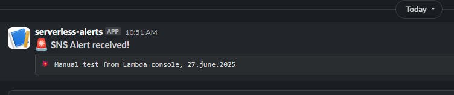

# AWS Security Alerting Pipeline


  End-to-end real-time threat detection and alerting system built on AWS with Terraform and Python Lambda functions.

## Table of Contents

- [Initial Use Case](#initial-use-case)
- [Use Case](#use-case)
- [Stack](#stack)
- [Architecture](#architecture)
- [Project Structure](#project-structure)
- [Detailed Setup & Features](#detailed-setup--features)
- [What I Learned](#what-i-learned)
- [Author](#author)
- [License](#license)
- [Security Policy](#security-policy)

---

## Initial Use Case
> Detect and alert when a new IAM user is created (`CreateUser` event in AWS CloudTrail).

---

## Use Case
Detects suspicious activity like:
- IAM user creation  
- Root login without MFA  
- GuardDuty findings (SSH brute-force, port scan)  
- AWS Config non-compliant resources (e.g., public S3)

---

## Stack

| Category      | Technology                         |
|---------------|------------------------------------|
| IaC           | Terraform                          |
| Detection     | CloudTrail, GuardDuty, AWS Config  |
| Processing    | Lambda (Python)                    |
| Alerting      | SNS, Slack                         |
| Optional UI   | Flask receiver in Docker/K8s       |

---

## Architecture


1. CloudTrail or GuardDuty detects an event  
2. EventBridge filters and routes the event  
3. Lambda formats the alert and sends via SNS  
4. Alerts go to email, Slack, or an external receiver

---

## Project Structure

```bash
terraform/ # Infrastructure as Code
lambda/ # Lambda functions (Python)
tests/ # Sample CloudTrail/GuardDuty events
alert-receiver/ # Flask app (containerized)
ansible/ # AWS CLI provisioning
k8s/ # Kubernetes deployment manifests
```

## 🔔 Slack Integration – Alert Example

This is a real example of a manual test alert sent via AWS Lambda → SNS → Slack.  
The alert was triggered by a Lambda function subscribed to an SNS topic:



## Detailed Setup & Features

See [docs/DETAILS.md](docs/DETAILS.md) for:

- Deployment instructions  
- Sample test events  
- Lambda test CLI commands  
- Slack integration setup  
- Roadmap and future improvements

---

## What I Learned

- How to use Terraform to deploy a real security alerting pipeline  
- How IAM, GuardDuty, EventBridge, Lambda, and SNS integrate  
- How to log to CloudWatch and test Lambda manually  
- Hands-on experience with GuardDuty in a personal project  
- Basics of Docker and Kubernetes for alert receiver deployment

---
## Why This Project?

The AWS Security Alerting Pipeline was created to:
- Gain hands-on experience with Terraform, Lambda, SNS, and security services
- Build a real-world cloud monitoring & alerting use case
- Demonstrate cloud infrastructure skills and DevSecOps thinking
- Provide actionable Slack/email alerts on suspicious activities in near real-time


## Author

**Adam Wrona** – aspiring DevOps / AWS Cloud Engineer  
🔗 [LinkedIn](https://www.linkedin.com/in/adam-wrona-111ba728b) • [GitHub](https://github.com/cloudcr0w)

_Last updated: July 3, 2025_

---

## License

[MIT](LICENSE)

---

## Security Policy

For vulnerability reports, please see [SECURITY.md](SECURITY.md)

```markdown
> "Trust me, I'm a Lambda."  
> — this function, probably right before it timed out
```